# 다국어 영수증 OCR
<br>

## 1. 💻 프로젝트 주제

- 이 프로젝트의 주제는 Data-Centric 접근을 통한 다국어 영수증 텍스트 검출입니다. OCR (Optical Character Recognition) 기술은 이미지 속의 텍스트를 컴퓨터가 인식할 수 있도록 변환하는 기술로, 이번 프로젝트에서는 다양한 언어의 영수증 데이터를 대상으로 OCR 모델을 학습시키고 최적화하는 데 중점을 둡니다. 

- 저희는 Data-Centric 접근을 통해 학습 데이터를 보강하고 정제하여 모델의 성능을 향상시키는 전략을 채택하였으며, 이를 통해 OCR 모델이 언어에 상관없이 영수증의 텍스트를 빠르고 정확하게 검출할 수 있도록 목표를 설정했습니다.

<br>

## 2. 🧑‍🤝‍🧑 Team ( CV-20 : CV Up!!)
<div style="display: flex; justify-content: center; align-items: center; height: 100vh;">
    <table style="margin: auto; border-collapse: collapse;">
        <tr height="160px">
            <td align="center" width="150px">
                <a href="https://github.com/kaeh3403"></a>
                <br/>
                <a href="https://github.com/kaeh3403"><strong>김성규</strong></a>
                <br />
            </td>
            <td align="center" width="150px">
                <a href="https://github.com/sweetpotato15"></a>
                <br/>
                <a href="https://github.com/sweetpotato15"><strong>김유경</strong></a>
                <br />
            </td>
            <td align="center" width="150px">
                <a href="https://github.com/jeajin"></a>
                <br/>
                <a href="https://github.com/jeajin"><strong>김재진</strong></a>
                <br />
            </td>
            <td align="center" width="150px">
                <a href="https://github.com/SuyoungPark11"></a>
                <br />
                <a href="https://github.com/SuyoungPark11"><strong>박수영</strong></a>
                <br />
            </td>
            <td align="center" width="150px">
                <a href="https://github.com/uddaniiii"></a>
                <br />
                <a href="https://github.com/uddaniiii"><strong>이단유</strong></a>
                <br />
            </td>
    </table> 
</div>

|Name|Roles|
|:---:|:---:|
|김성규| 타임라인 관리, EDA 분석 |
|김유경| 보고서 관리, slack 아이디어 공유, EDA 분석 |
|김재진| Github 관리, EDA 분석, HEM |
|박수영| 코드 리팩토링, EDA 분석|
|이단유| 보고서 관리, EDA 분석|

wrap up 레포트 : [wrap up report](etc/cv_20_OCR_Wrap-Up_Report.pdf)

<br>

## 3. 📸 데이터 EDA
-  baseline의 inference 결과를 시각화 해봤을때 영수증의 구분선이나 특수문자가 있는 부분에서 예측이 잘 안되는  경향을 보였기 때문에 json파일의 transcription이 비어있거나, 특수문자가 50% 이상 포함되어 있는 객체들을 제외하고 학습을 진행하여 예측 정확도를 올리는 가설을 설정했습니다.

<br>
<div style="text-align: center;">
  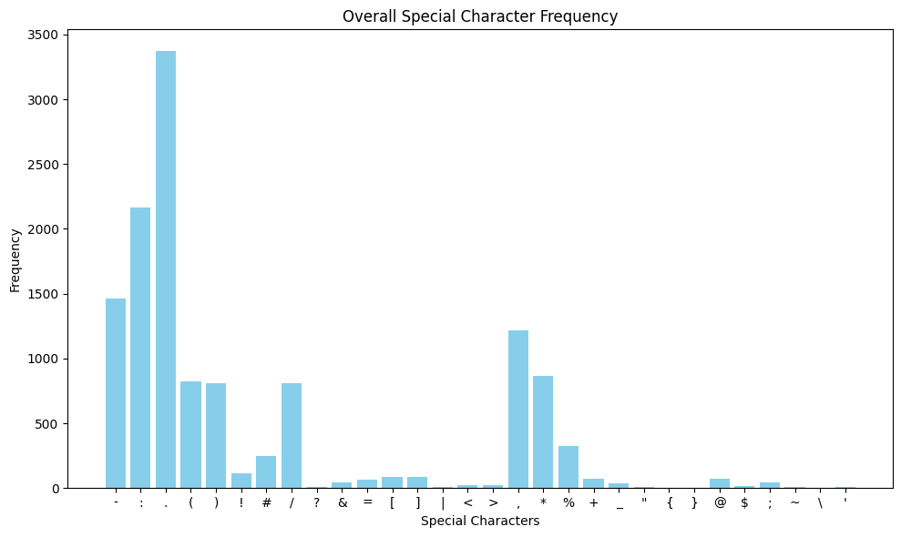
  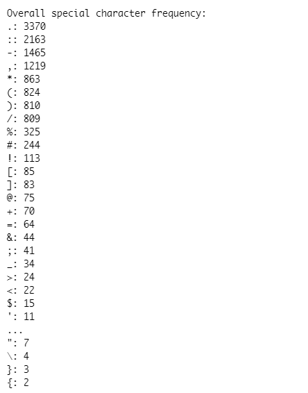
</div>
<br>


- 또한, 이미지의 RGB 채널의 평균값을 분석한 결과, 각 채널이 유사한 분포를 보이고 있으며 주로 120~180 사이에 집중되어 있음을 확인했습니다. 이는 색상 정보가 이미지에서 상대적으로 덜 중요하다고 판단하여, 색상에 따른 잡음이나 변동을 줄이기 위해 그레이스케일을 적용하는 방안을 고려하였습니다. 

<br>
<div style="text-align: center;">
  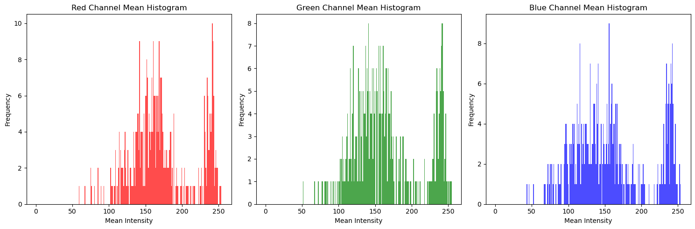
</div>
<br>


- bounding box 각도 분포를 보면 대부분이 x축에 평행인 분포를 보였으나, 일부 객체의 비틀어진 분포를 확인했습니다. 또한, 이미지 상에서 영수증 영역 밖으로 나오는 bbox가 존재하는 것을 확인했습니다. 이러한 문제를 해결하기 위해 Relabeling 작업을 결정하였습니다.

<br>
<div style="text-align: center;">
  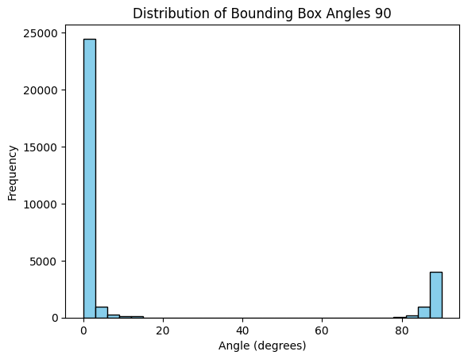
</div>
<br>


- 언어별 이미지 면적 대비 bounding box 객체 합의 비율 분포를 시각화한 결과 대부분 이미지의 50% 이하 면적을 차지함을 확인했습니다.


<br>
<div style="display: grid; grid-template-columns: repeat(2, 1fr); gap: 10px;">
  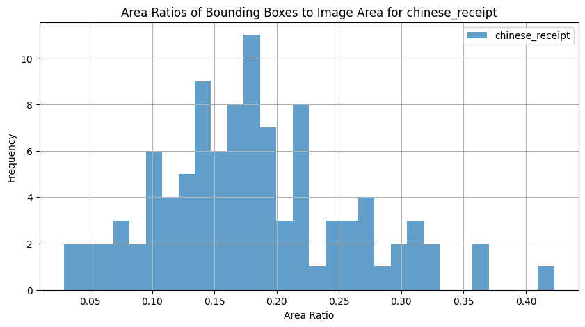
  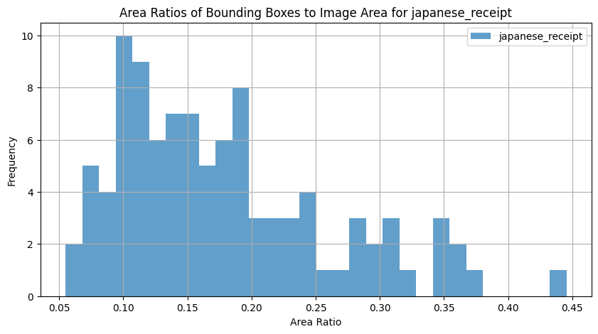
  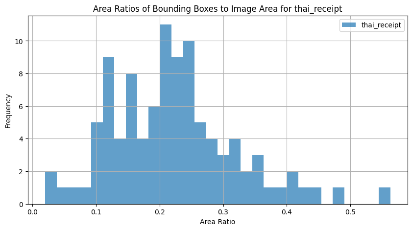
  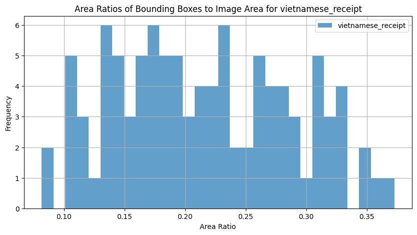
</div>
<br>


- 또한 bounding box의 중심점 분포를 시각화한 결과 매우 다양한 크기의 이미지들이 존재하지만 어느 정도의 이미지 크기에 가장 객체가 많이 존재하는지 확인하였습니다.
이 결과들을 통해 영수증의 영역([x_min,y_min],[x_max, y_max])만 crop하여 입력으로 넣는 방안을 고려했습니다.

<br>
<div style="display: grid; grid-template-columns: repeat(2, 1fr); gap: 10px;">
  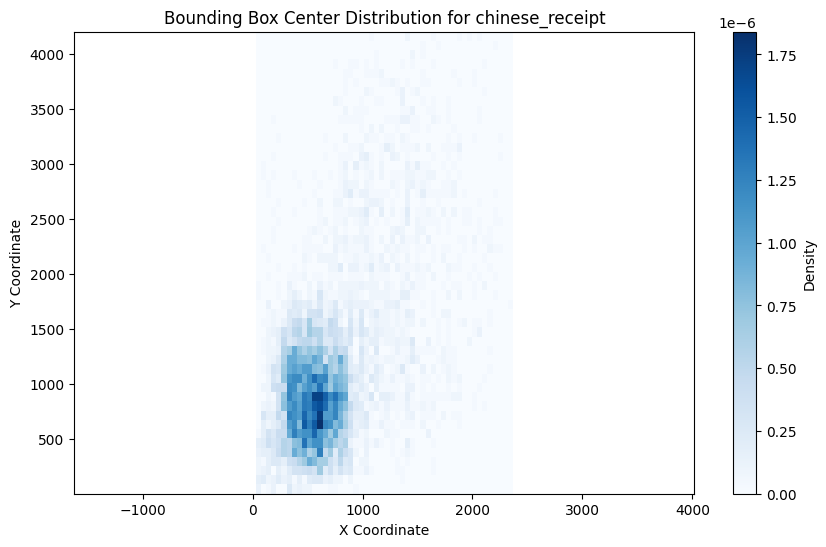
  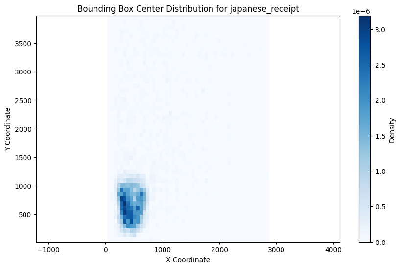
  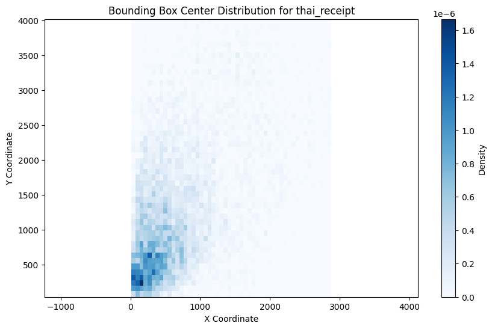
  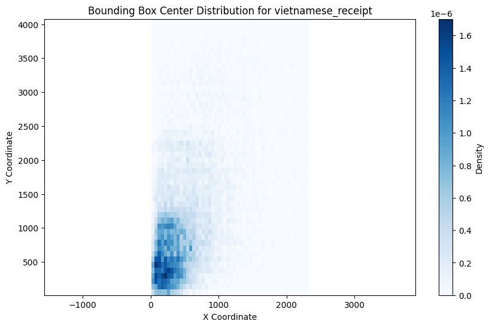
</div>
<br>


<br>

## 4. 📝프로젝트 수행 결과
### 4.1. Data preprocessing

<br>

- 특수문자 제거
    EDA 결과를 바탕으로 영수증 안의 구분선을 어지럽게 예측하는 문제점을 해결하기위해 transcription의 50%이상이 특수문자이거나 비어있으면(구분선) 그 객체를 제외하고 학습하였습니다. 
    실험 결과를 시각화했을때 바운딩박스가 더 잘 예측된 것 같았지만, precision이 오르고 recall이 떨어져 성능이 근소하게 낮아졌습니다. 하여 구분선을 포함하여 학습하기로 하였습니다.
  
<div style="display: flex; justify-content: center; align-items: center; height: 100vh;">
  <table style="margin: auto; border-collapse: collapse;">
    <thead>
      <tr>
        <th>Data</th>
        <th>Precision</th>
        <th>Recall</th>
        <th>F1 score</th>
      </tr>
    </thead>
    <tbody>
      <tr>
        <td>Original</td>
        <td>0.7775</td>
        <td>0.8570</td>
        <td>0.8153</td>
      </tr>
      <tr>
        <td>Remove special characters</td>
        <td>0.8659</td>
        <td>0.7673</td>
        <td>0.8136</td>
      </tr>
    </tbody>
  </table>
</div>

   

<br>

- Gray-Scale
    
    색상에 따른 잡음이나 변동을 줄이기 위해 그레이스케일 전처리 기법을 적용했으며, 단일 채널로 구성하여 메모리 사용량과 연산 시간을 줄일 수 있었습니다.
    그 결과, precision이 0.7775에서 0.8071로 상승하며 최종 F1 score가 증가하는 것을 확인했습니다.    
<div style="display: flex; justify-content: center; align-items: center;">
  <table style="margin: auto;">
    <thead>
      <tr>
        <th>Data</th>
        <th>Gray-Scale</th>
        <th>Precision</th>
        <th>Recall</th>
        <th>F1 score</th>
      </tr>
    </thead>
    <tbody>
      <tr>
        <td>Original</td>
        <td>X</td>
        <td>0.7775</td>
        <td>0.8570</td>
        <td>0.8153</td>
      </tr>
      <tr>
        <td>Original</td>
        <td>O</td>
        <td>0.8071</td>
        <td>0.8483</td>
        <td>0.8272</td>
      </tr>
    </tbody>
  </table>
</div>
    

    
<br>

- Relabeling
    
    CVAT(Computer Vision Annotation Tool)를 활용하여 영수증 밖으로 벗어난 바운딩 박스를 조정하고, angle loss를 줄이기 위해 바운딩 박스가 x축에 평행하도록 수정했습니다. 또한, 바운딩 박스의 좌표를 좌상단부터 시계 방향 순으로 정렬하여 일관성을 높였습니다.
    Relabeling한 데이터로 실험해본 결과, F1 score는 유사했으나 precision이 0.7775에서 0.8093으로 상승하여 예측의 신뢰도가 향상되었습니다. 이에 따라 이후 실험은 Relabeling한 데이터를 기반으로 진행했습니다.    
<div style="display: flex; justify-content: center; align-items: center;">
  <table style="margin: auto;">
    <thead>
      <tr>
        <th>Data</th>
        <th>Precision</th>
        <th>Recall</th>
        <th>F1 score</th>
      </tr>
    </thead>
    <tbody>
      <tr>
        <td>Original</td>
        <td>0.7775</td>
        <td>0.8570</td>
        <td>0.8153</td>
      </tr>
      <tr>
        <td>Relabeling</td>
        <td>0.8093</td>
        <td>0.8174</td>
        <td>0.8134</td>
      </tr>
    </tbody>
  </table>
</div>
    

    
<br>

- Crop
    
    영수증 이미지의 배경 노이즈를 줄이기 위해 바운딩 박스를 기준으로 이미지를 크롭하여 실험을 진행했습니다. 영수증 영역의 경계를 나타내는 bounding box의 좌표 중 x축과 y축의 최소/최대값을 기준으로 영수증 영역만을 남기고 배경을 제거했습니다.
    결과적으로 F1 score가 크게 감소하였으며, 영수증의 주요 정보 뿐만 아니라 배경 또한 학습에 필요한 정보임을 알 수 있었습니다.    
<div style="display: flex; justify-content: center; align-items: center;">
  <table style="margin: auto;">
    <thead>
      <tr>
        <th>Data</th>
        <th>Crop</th>
        <th>Precision</th>
        <th>Recall</th>
        <th>F1 score</th>
      </tr>
    </thead>
    <tbody>
      <tr>
        <td>Relabeling</td>
        <td>X</td>
        <td>0.8093</td>
        <td>0.8174</td>
        <td>0.8134</td>
      </tr>
      <tr>
        <td>Relabeling</td>
        <td>O</td>
        <td>0.6798</td>
        <td>0.7290</td>
        <td>0.7036</td>
      </tr>
    </tbody>
  </table>
</div>
    

    
<br>

- Hard Example Mining
    
    절취선과 같은 어려운 예제들에 집중하여 모델 성능을 높이고자 3단계에 걸쳐 학습을 진행했습니다.
    
    - Phase 1 : 탐지가 어려운 절취선(ex: ‘*********”)등의 바운딩 박스를 iou 하위 30%인 박스만을 남기고(나머지 마스킹) 학습 진행
        - Phase 1에서 iou 하위 30%(0.62)에 속하는 박스만을 학습에 활용했으나, 학습 후 이들 중 38%의 박스가 IOU 0.62 이상으로 향상
    - Phase 2 : 전체 데이터의 80%로 학습
    - Phase 3 : 전체 데이터로 학습
    Phase 2부터 baseline 대비 F1 score가 1.96% 향상되었으며, Phase 3에서 추가로 3.21% 상승했습니다. 다만 절취선 탐지는 여전히 기대에 미치지 못해, 하위 10%만 마스킹하는 방식으로 개선 가능성을 기대할 수 있었습니다.    
<div style="display: flex; justify-content: center; align-items: center;">
  <table style="margin: auto;">
    <thead>
      <tr>
        <th>Data</th>
        <th>Experiment</th>
        <th>Precision</th>
        <th>Recall</th>
        <th>F1 score</th>
      </tr>
    </thead>
    <tbody>
      <tr>
        <td>Original</td>
        <td>Baseline</td>
        <td>0.7996</td>
        <td>0.8718</td>
        <td>0.8341</td>
      </tr>
      <tr>
        <td>Original</td>
        <td>Phase 1</td>
        <td>0.2736</td>
        <td>0.3789</td>
        <td>0.3177</td>
      </tr>
      <tr>
        <td>Original</td>
        <td>Phase 2</td>
        <td>0.8271</td>
        <td>0.8822</td>
        <td>0.8537</td>
      </tr>
      <tr>
        <td>Original</td>
        <td>Phase 3</td>
        <td>0.8477</td>
        <td>0.8857</td>
        <td>0.8663</td>
      </tr>
    </tbody>
  </table>
</div>
<br>


### 4.2. Data 수집

<br>

- CORD (Consolidated Receipt Dataset)
    
    CLOVA에서 공개한 OCR 영수증 데이터셋으로, 총 1,000건의 인도네시아 가게 및 식당 영수증 이미지로 구성되어 있습니다. 각 이미지는 1:1 대응되는 JSON 파일과 함께 제공되며, 이 중 train과 validation으로 제공된 900장의 이미지를 사용하였습니다.
    
<br>

- SROIE (Scanned Receipts OCR and Information Extraction)
    
    SROIE 데이터셋은 ICDAR 2019의 Robust Reading Challenge의 일환으로 제작된 스캔된 영수증 OCR 및 정보 추출(SROIE)용 데이터셋입니다. 데이터셋에는 영어로 작성된 영수증 이미지가 포함되어 있으며, 각 이미지에 대응하는 txt 파일도 제공되어 총 626장의 이미지를 사용하였습니다.
    

<div style="display: flex; justify-content: center; align-items: center;">
  <table style="margin: auto;">
    <thead>
      <tr>
        <th>Data</th>
        <th>Experiment</th>
        <th>Precision</th>
        <th>Recall</th>
        <th>F1 score</th>
      </tr>
    </thead>
    <tbody>
      <tr>
        <td>Relabeling</td>
        <td></td>
        <td>0.8093</td>
        <td>0.8174</td>
        <td>0.8134</td>
      </tr>
      <tr>
        <td>Relabeling + CORD</td>
        <td>Gray-Scale</td>
        <td>0.8995</td>
        <td>0.8606</td>
        <td>0.8796</td>
      </tr>
      <tr>
        <td>Relabeling + CORD + SROIE</td>
        <td>Gray-Scale</td>
        <td>0.8901</td>
        <td>0.7419</td>
        <td>0.8092</td>
      </tr>
    </tbody>
  </table>
</div>

### 4.3. Finetuning

Grid Search, Random Search, Bayesian Optimization, TPE(Tree-structured Parzen Estimator), PBT(Population-based Training) 등의 방법을 고려했지만 시간 상의 관계로 Bayesian Optimization을 사용하는 것이 효율적이라고 판단하여 실험했습니다. 하지만 성능이 좋지 않아 최종 결과에는 적용하지 않았습니다.

<br>

### 4.4. Ensemble

여러 모델의 예측 결과를 결합하여 모델의 일반화 성능을 향상시키기 위해 앙상블을 진행하였습니다. 모델 특성 상 confidence score를 얻을 수 없는 점을 감안하여 IOU 임계값과 투표 수를 기준으로 여러 모델의 예측 결과를 결합하는 방식으로 앙상블을 진행했습니다. 구체적으로, 여러 모델의 예측을 IOU를 기준으로 병합하고, 각 박스가 최소 투표 수 이상의 모델에서 동의한 결과일 경우에만 최종 박스로 확정했습니다. 이를 통해, 각 모델의 예측을 보강하고, 서로 겹치는 예측을 평균화하여 더 정확한 결과를 얻을 수 있었습니다.

<div style="display: flex; justify-content: center; align-items: center;">
  <table style="margin: auto;">
    <thead>
      <tr>
        <th></th>
        <th>Dataset</th>
        <th>Preprocessing</th>
        <th>Precision</th>
        <th>Recall</th>
        <th>F1 score</th>
      </tr>
    </thead>
    <tbody>
      <tr>
        <td>Model 1</td>
        <td>Relabel</td>
        <td>Hard Example Mining</td>
        <td>0.8477</td>
        <td>0.8857</td>
        <td>0.8663</td>
      </tr>
      <tr>
        <td>Model 2</td>
        <td>Relabel + CORD</td>
        <td>Gray-Scale</td>
        <td>0.8995</td>
        <td>0.8606</td>
        <td>0.8796</td>
      </tr>
      <tr>
        <td>Model 3</td>
        <td>Base + CORD</td>
        <td></td>
        <td>0.8661</td>
        <td>0.8754</td>
        <td>0.8707</td>
      </tr>
    </tbody>
  </table>
</div>

위의 세 모델로 앙상블한 결과 가장 좋은 성능을 보였습니다. 

<div style="display: flex; justify-content: center; align-items: center;">
  <table style="margin: auto;">
    <thead>
      <tr>
        <th>IOU threshold</th>
        <th>Vote</th>
        <th>Model</th>
        <th>Precision</th>
        <th>Recall</th>
        <th>F1 score</th>
      </tr>
    </thead>
    <tbody>
      <tr>
        <td>0.7</td>
        <td>2</td>
        <td>1 + 2 + 3</td>
        <td>0.9427</td>
        <td>0.8679</td>
        <td>0.9038</td>
      </tr>
    </tbody>
  </table>
</div>


<br>

## 5. 전체 파이프라인
<div style="text-align: center;">
  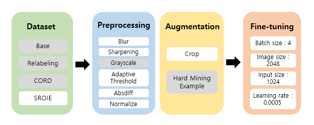
</div>
<br>

- **GPU:** Tesla V100-SXM2-32GB
- **CPU**: Intel(R) Xeon(R) Gold 5120 CPU @ 2.20GHz
- **운영체제**: Ubuntu 20.04.6 LTS (Focal Fossa)


```
부스트코스 강의 수강 및 과제 : 24.09.30 ~ 24.10.06
데이터 EDA / 데이터 전처리 / 베이스라인 모델 학습 : 24.10.07 ~ 24.10.13
데이터 증강 및 모델 성능 개선 : 24.10.14 ~ 24.10.18
하이퍼 파라미터 튜닝 / 앙상블 : 24.10.19 ~ 24.10.24
최종 자료 정리 및 문서화 : 24.10.25 ~ 24.10.28
```

<br>

## 6. 프로젝트 구조
프로젝트는 다음과 같은 구조로 구성되어 있습니다. 
```
📦level2-cv-datacentric-cv-20
 ┣ 📂base
 ┣ 📂data
 ┣ 📂data_loader
 ┣ 📂eda
 ┣ 📂predictions
 ┣ 📂trained_models
 ┣ 📜deteval.py
 ┣ 📜inference.py
 ┣ 📜requirements.txt
 ┗ 📜train.py
```

<br/>

## 7. 기타사항

- 본 프로젝트에서 사용한 데이터셋의 적용 저작권 라이선스인 CC-BY-NC-ND([link](https://creativecommons.org/licenses/by/2.0/kr/))의 가이드를 준수하고 있습니다.

